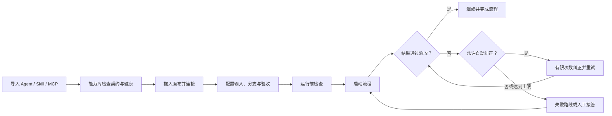

# PRD - Agent Firewall 智能体编排平台

状态：Draft  
范围：首个可用 Beta 及后续自动化版本  
相关文档：[用户故事](user-stories-agent-orchestration.md)、[当前桌面界面](../desktop/renderer/index.html)

## 1. Summary

Agent Firewall 是一个面向普通用户和业务人员的智能体编排平台。用户可以从本地文件、Git、远程 Agent 和 MCP Server 导入别人已经写好的 Agent、Skill 和 Tool，再用可视化流程把它们组合成可以重复运行、自动验收、自动纠正并在必要时由人接管的完整自动化。

首版重点不是帮助用户开发新 Agent，而是让用户在不写代码、不编辑 JSON 的情况下，安全复用已有能力并完成第一条可靠流程。

## 2. Contacts

| Name | Role | Comment |
| --- | --- | --- |
| TBD | Product Owner | 确认用户范围、首版目标和成功指标 |
| TBD | Engineering Lead | 负责导入契约、流程运行时和桌面应用 |
| TBD | Product Designer | 负责导入中心、编排画布和运行交互 |
| TBD | Security Reviewer | 审核凭据、第三方代码和执行策略边界 |
| Agent Firewall maintainers | Maintainers | 维护现有 Python、Electron 和 SQLite 代码 |

## 3. Background

### 3.1 Problem

越来越多团队已经拥有可用的 Agent、Skill 和 MCP Tool，但这些能力通常分散在不同文件、仓库、框架和服务中。普通用户很难知道它们如何连接，也很难把多个能力稳定地组合成完整业务流程。

当前常见做法有三个问题：

1. 用户需要理解代码、命令行和不同框架的配置格式。
2. 工作流通常只负责依次调用，不能判断结果是否合格，也不能自动纠正。
3. 凭据、审批、失败恢复和运行记录分散，流程出错后很难继续或复现。

### 3.2 Why Now

Agent、Skill、MCP 和远程 Agent 协议正在形成较清晰的能力边界。输入输出 schema、工具发现和标准连接协议使跨来源编排开始变得可行。用户现在缺少的不是更多单个 Agent，而是一个把现有能力连接、运行和纠正起来的产品。

### 3.3 Current Product State

项目已有可视化画布、Agent/Skill/MCP 节点、状态分支、并行汇合、流程预检、重试、checkpoint、暂停恢复、运行事件、审批和脱敏能力。这些是可复用的运行底座。

当前主要缺口是：

- 缺少面向用户的一键导入中心和统一能力契约。
- Agent、MCP 和审批配置仍大量依赖原始 JSON。
- 画布被放在“高级编排”，没有成为产品主工作区。
- 缺少结果验收、有限自动纠正、触发器和已发布流程版本。
- 当前流程禁止环路；失败纠正主要依靠人工提交内容后恢复。

## 4. Objective

### 4.1 Objective

让不写代码的用户能够导入现成 Agent、Skill 和 Tool，在一个工作区内完成编排、运行、结果验收与自动纠正，并把验证过的流程交给系统重复执行。

这会把 Agent Firewall 从开发者工具转成用户可以直接使用的自动化产品。它也保留现有执行策略和审计能力，使导入的第三方能力不会成为完全不可见的黑盒。

### 4.2 Key Results

1. 首个 Beta 中，至少 80% 的试用用户可以在 20 分钟内完成“导入能力、创建至少 3 个节点的流程、映射输入并成功运行”，全程不使用命令行或原始 JSON。
2. 使用至少 30 个代表性 Agent、Skill 和 MCP Tool 测试本地/ZIP、Git、远程 Agent、MCP 四类来源，首次导入并完成契约检查的成功率达到 90% 以上，明文凭据落入流程、日志或导出包的事件为 0。
3. 在至少 100 次包含验收失败的流程运行中，70% 以上可以通过有限自动纠正或一次人工输入继续完成；所有运行都在配置的步骤和纠正次数内结束，无无限执行和未经保护的重复副作用。

### 4.3 North Star Metric

**每周成功完成的自动化流程运行数**。一次运行只有在流程到达结束节点、关键验收规则通过，并保存完整运行记录时才计数。

## 5. Market Segment(s)

### 5.1 Primary Segment: Capability Consumers

这些用户已经能获得别人写好的 Agent、Skill 或 Tool，但不会或不想维护它们的代码。他们的任务是把多个能力组成一条能完成工作的流程。

典型工作包括内容收集与审核、研究与报告、客户请求处理、代码检查、数据整理和多系统更新。

### 5.2 Secondary Segment: Team Automation Owners

这些用户为小团队维护重复工作。他们需要固定版本、定时运行、失败恢复和可查看的运行记录，但不希望搭建完整的工作流基础设施。

### 5.3 Supporting Segment: Platform Operators

这些用户管理模型、Git、远程 Agent 和 MCP 凭据，并决定哪些操作需要审批。他们关注连接健康、秘密保护和执行范围。

### 5.4 Constraints

- 用户不能被要求理解每个 Agent 框架。
- 第三方能力质量不一致，可能缺少清晰输入输出契约。
- Skill 或远程 Tool 可能执行写文件、网络访问等有副作用的操作。
- 本地桌面应用关闭后，定时和 Webhook 运行需要独立后台运行时。
- 首版是受治理的本地执行，不提供容器或 VM 级强隔离保证。

## 6. Value Proposition(s)

### 6.1 Customer Gains

- 复用现成能力，不需要从头开发 Agent。
- 用拖拽和表单完成编排，不需要手写配置文件。
- 结果不合格时可以自动纠正，而不是直接失败。
- 自动化无法继续时，可以从失败节点接管和恢复。
- 每次运行都有清晰结果、过程和版本记录。

### 6.2 Customer Pains Avoided

- 不再为每种 Agent 或 Tool 编写不同接入代码。
- 不再在多个终端、日志和配置文件之间排查流程。
- 不会因为能力升级而静默改变已发布流程。
- 不会在流程导出或运行日志中意外暴露凭据。
- 不会让自动纠正无限运行或重复危险操作。

### 6.3 Differentiation Hypothesis

以下是待用户研究验证的方向性假设，不代表已完成市场调研。

| Dimension | 手工框架集成 | 通用自动化工具 | Agent 创建平台 | Agent Firewall |
| --- | --- | --- | --- | --- |
| 导入现成 Agent/Skill | 低 | 低 | 中 | 高 |
| 多来源能力统一契约 | 低 | 中 | 中 | 高 |
| 可视化智能体编排 | 低 | 高 | 高 | 高 |
| 结果验收与自动纠正 | 低 | 低 | 中 | 高 |
| 暂停、审批和原节点恢复 | 低 | 中 | 中 | 高 |
| 本地运行与证据记录 | 中 | 中 | 低至中 | 高 |

产品不与底层 Agent 框架竞争。它位于这些框架之上，负责导入、组合、运行和纠正。

## 7. Solution

### 7.1 UX/Prototypes

#### Information Architecture

首版主导航调整为：

1. **Workflows**：默认首页，管理和编辑流程。
2. **Capabilities**：导入和查看 Agent、Skill、Tool。
3. **Runs**：查看实时运行、历史、结果和恢复操作。
4. **Connections & Policy**：管理凭据、连接和审批规则。
5. **Templates**：从模板创建流程，首版后期提供。
6. **Settings**：模型和本地运行时设置。

现有“测试与修复”不再作为默认首页。它的断言、诊断、修订和比较能力并入节点验收、运行详情和流程版本管理。

#### Main Workflow

#### Main Screen Layout

- 左侧：可搜索的能力列表和流程结构。
- 中间：全屏编排画布，运行时直接显示节点状态。
- 右侧：当前节点的输入、输出、重试、验收和纠正设置。
- 底部抽屉：预检问题、运行事件和最终结果，不覆盖主要画布。

首版设计需要覆盖空状态、导入中、连接失败、预检失败、运行中、等待用户、自动纠正和完成状态。

### 7.2 Key Features

#### 7.2.1 Import Center

用户可以从本地文件夹、ZIP、Git URL、Agent Firewall 能力包、MCP Server 和一种受支持的远程 Agent 协议导入能力。

导入流程必须包含扫描、预览、契约检查、权限提示和确认。导入的文件复制到受管理目录；远程能力保存连接和发现结果。Git 更新必须由用户确认，不能修改已发布流程固定使用的旧版本。

对应用户故事：US-01、US-02、US-03。

#### 7.2.2 Unified Capability Contract

每个可执行能力至少包含：

- 稳定 ID、类型、名称和说明；
- 来源、版本和内容哈希；
- 输入 schema 和输出 schema；
- 调用方式和所需凭据引用；
- 可能的文件、命令、网络和环境权限；
- 当前健康和兼容状态。

缺少完整输出 schema 的能力仍可导入，但系统必须把下游字段引用标记为不确定，并要求用户提供示例运行或手工定义输出。

对应用户故事：US-04。

#### 7.2.3 Connections and Credentials

平台操作员可以配置模型、Git、远程 Agent 和 MCP 连接。流程只保存凭据引用。所有日志、事件、错误、导出包和运行快照在持久化前脱敏。

首版优先使用操作系统安全存储或环境变量引用，不在普通 SQLite 配置字段中保存可再次读取的明文密钥。

对应用户故事：US-05。

#### 7.2.4 Visual Orchestration

用户可以拖入 Agent、Skill Action 和 MCP Tool，连接节点并配置成功、失败、等待输入、被阻止和字段条件路线。独立分支可以并行，汇合节点等待所有已激活上游完成。

节点输入通过表单配置，可以引用固定值、流程输入或前序节点输出。原始 JSON 只在高级模式中出现。画布支持自动保存、撤销、重做和键盘操作。

对应用户故事：US-06、US-07、US-08。

#### 7.2.5 Preflight

运行前检查流程结构、能力版本、连接健康、凭据、输入类型、审批规则和执行上限。阻断问题必须修复，警告可以确认后继续。点击问题应定位到对应节点或字段。

对应用户故事：US-09。

#### 7.2.6 Runtime and Monitoring

用户可以输入目标和初始数据后手动运行流程。画布实时显示节点状态，运行详情保存输入来源、输出摘要、事件、尝试次数、耗时和最终结果。用户可以取消运行，并在重开应用后继续查看记录。

对应用户故事：US-10、US-16。

#### 7.2.7 Validation and Automatic Correction

用户可以在节点或流程结束处配置确定性验收规则，也可以选择评审 Agent 处理主观判断。验收失败时，系统可以进入失败路线、人工接管或有限自动纠正。

自动纠正配置包括纠正 Agent、提示、可用上下文和最大次数。每次尝试后重新验收。达到上限后必须结束自动纠正。有副作用的节点只有在声明幂等或得到审批后才能自动重复执行。

首版不支持任意画布环路。纠正作为节点的受限运行策略实现，复用现有 checkpoint、retry 和 resume 能力。

对应用户故事：US-11、US-12。

#### 7.2.8 Recovery and Human Control

节点可以配置重试、兼容的备用能力或人工接管。流程暂停时展示原因、上下文和允许的动作。用户提交输入、纠正或审批后，从当前节点继续，不重复已完成节点。

对应用户故事：US-13。

#### 7.2.9 Triggers, Versions and Sharing

已发布流程可以通过手动、定时和带密钥的 Webhook 触发。触发器固定到流程版本，并支持并行、跳过重复或排队策略。

用户可以发布不可变流程版本、从旧版本创建新草稿、复制为模板，以及导入导出不含凭据的流程包。

对应用户故事：US-14、US-15。

#### 7.2.10 Non-functional Requirements

- 导入一个包含 100 个文件的本地能力包，预览结果应在 10 秒内出现。
- 运行事件写入后 2 秒内显示在桌面界面。
- 所有运行必须受最大步骤、最大重试和最大纠正次数限制。
- 打包应用不依赖项目 Python 或 Node.js 环境即可运行。
- 关键流程创建和运行操作必须支持键盘访问。
- 第三方能力执行失败不能破坏流程定义、已发布版本或历史运行记录。

### 7.3 Technology

#### Existing Components to Reuse

- Python `FlowSpec`、runner、checkpoint 和 resume 机制。
- Agent、Skill Action 和 MCP Tool 节点执行器。
- SQLite 配置、流程、运行和事件存储。
- 流程预检、策略审批、路径/命令/网络检查和脱敏。
- Electron 桌面应用和现有画布。

#### Required Changes

1. 新增受管理能力存储和统一能力版本记录。
2. 新增本地/ZIP、Git、MCP 和远程 Agent 导入器。
3. 为节点提供结构化输入输出映射，替换主要路径中的 JSON 文本框。
4. 扩展边条件，支持字段判断；保留无环流程结构。
5. 新增验收规则和节点级有限纠正策略。
6. 新增不可变流程版本、触发器和运行与版本绑定。
7. 为定时和 Webhook 提供可独立运行的本地后台进程。
8. 将凭据迁移到安全存储或只保存环境变量引用。

#### Security Boundary

首版可以检查和治理声明的操作，但不能证明任意第三方 Python 代码没有访问操作系统资源。产品必须使用“受治理的本地执行”描述当前能力。需要强隔离时，应在后续版本增加容器、VM 或平台 sandbox worker。

### 7.4 Assumptions

| Assumption | Risk | Validation |
| --- | --- | --- |
| 用户已经有可复用 Agent、Skill 或 MCP Tool | 用户可能更需要创建 Agent | 访谈至少 10 名目标用户并收集现有资产样本 |
| 四类首批来源覆盖主要需求 | 来源可能过多且格式差异大 | 用至少 30 个真实能力包做导入测试 |
| 输入输出 schema 足以支持无代码映射 | 很多能力可能没有输出 schema | 记录缺失比例，并测试示例运行生成契约 |
| 有限纠正能解决常见结果问题 | 主观任务可能反复失败或成本过高 | 统计纠正成功率、次数、耗时和模型成本 |
| 用户接受本地优先产品 | 团队可能要求云端常驻和共享 | 在试用中记录后台运行与多人协作需求 |
| 一个远程 Agent 协议可支撑首版 | 生态协议可能尚未收敛 | 在实现前比较 ACP、A2A 等协议的真实样本 |

## 8. Release

### 8.1 Release 0.1: First Automation

预计 3-4 个 Sprint。

包含：

- 本地/ZIP、Git、MCP 和一种远程 Agent 协议导入；
- 统一能力库和连接凭据；
- 以流程画布为默认首页；
- 表单化节点输入、基础状态分支和并行汇合；
- 完整预检、手动运行、实时状态、取消和历史记录；
- 人工输入、审批和失败节点恢复。

发布门槛：试用用户可以不使用命令行或原始 JSON，在 20 分钟内完成第一条 3 节点流程。

### 8.2 Release 0.2: Closed-loop Automation

预计在 0.1 后增加 2-3 个 Sprint。

包含：

- 节点和流程结果验收；
- 评审 Agent；
- 有限自动纠正；
- 备用能力和扩展字段条件；
- 运行重放与比较。

发布门槛：所有纠正运行都能在限制内结束；70% 的测试失败可自动纠正或只需一次人工输入。

### 8.3 Release 0.3: Unattended Workflows

预计在 0.2 后增加 2-3 个 Sprint。

包含：

- 不可变流程版本和发布；
- 定时和 Webhook 触发；
- 本地后台运行时；
- 模板、流程包导入导出和版本回滚。

发布门槛：桌面界面关闭后，已启用触发器仍能运行固定流程版本，并保留完整、脱敏的运行记录。

### 8.4 Future, Not First Version

- 在产品内从零开发或训练 Agent；
- 公共能力市场和自动安装任意来源代码；
- 多租户、团队角色和云端共享工作区；
- 任意图循环和没有上限的自治执行；
- 容器或 VM 级强隔离；
- 计费、配额和企业单点登录；
- 同时支持所有远程 Agent 协议和 Agent 框架。
