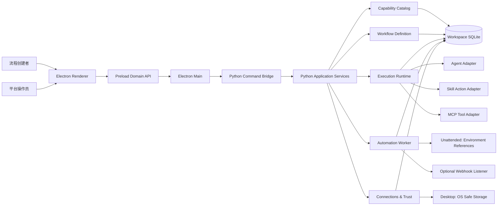
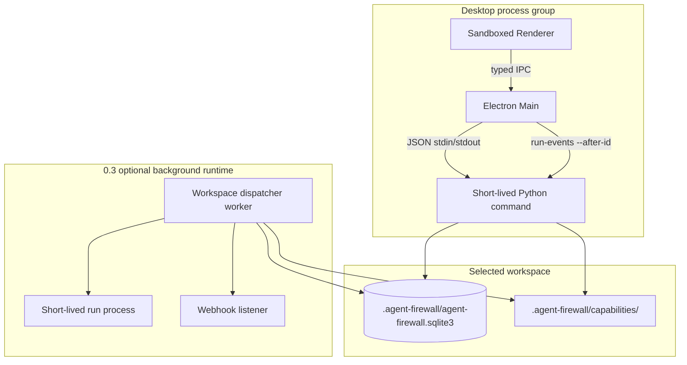
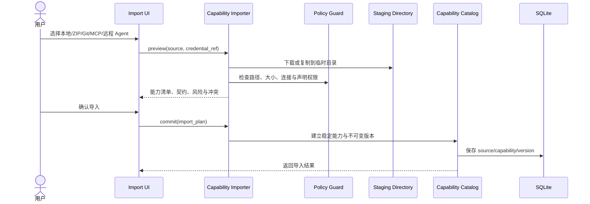
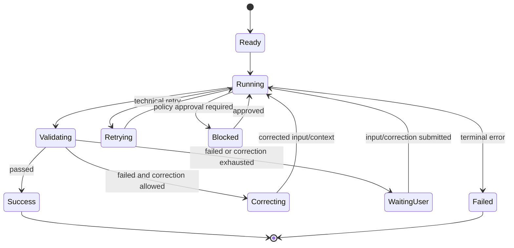
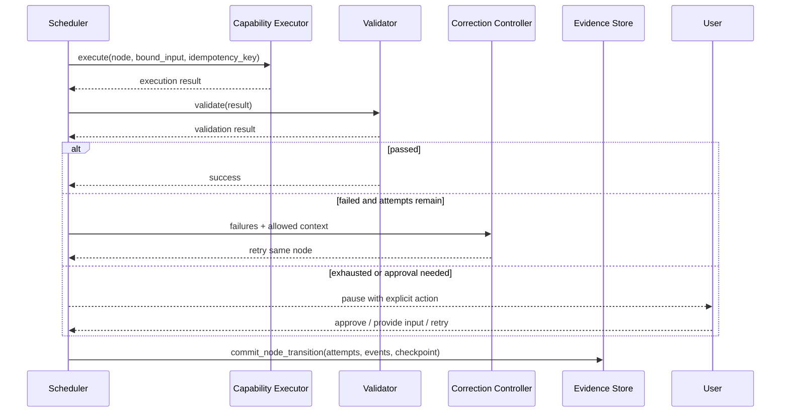
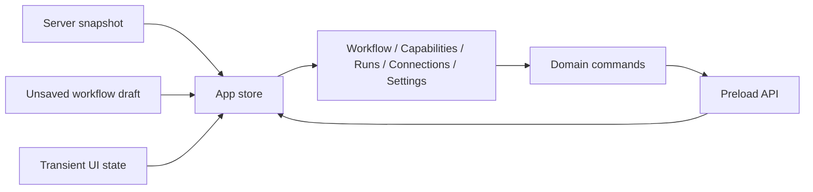

# Agent Firewall 前后端架构设计

> **文档说明**：基于 [Agent Firewall PRD](PRD-agent-firewall.md)，定义用户侧智能体导入、编排、运行、验收、纠正和自动触发的前后端目标架构。
>
> **版本**：V1.1.0  
> **最后更新**：2026-07-13  
> **状态**：待评审

## 1. Architecture Goals

1. 让用户不写代码、不编辑 JSON，也能导入并编排现成 Agent、Skill 和 MCP Tool。
2. 复用现有 Electron、Drawflow、Python runner、SQLite、checkpoint、policy 和打包链路。
3. 支持不可变能力版本和工作流版本，让历史运行可以按同一配置与依赖快照重建和比较；远端服务行为不承诺确定性。
4. 支持确定性验收、评审 Agent 和有限次数自动纠正。
5. 支持手动运行，并逐步扩展到定时和 Webhook 无人值守运行。
6. 明确安全边界：当前是受治理的本地执行，不是 OS sandbox。

## 2. Key Decisions

| Decision | Choice | Reason |
| :--- | :--- | :--- |
| Overall style | 模块化单体 | 当前规模不需要微服务，SQLite 和本地打包也更适合单体 |
| Frontend | Electron + 原生 ES Modules + Drawflow | 复用现有代码，首版不承担 React/Vue 迁移成本 |
| Backend | Python application modules + CLI/worker adapters | 保留现有命令行与打包能力，逐步增加后台运行 |
| Storage | SQLite WAL | 已有迁移与并发基础，适合单机工作区 |
| UI communication | Electron IPC + Python JSON 命令 + 增量事件轮询 | 当前 600ms 轮询可满足 2 秒事件目标，无需 WebSocket |
| Flow structure | 无环 DAG + 节点级有限纠正 | 避免任意循环和失控自治，复用 retry/checkpoint/resume |
| Secrets | 桌面在线使用 Electron `safeStorage`；无人值守只允许环境变量引用 | Python worker 无法在 Electron 退出后读取 `safeStorage`，两类凭据必须分开 |
| Background automation | 每工作区一个 dispatcher worker + SQLite 持久队列 | 让桌面关闭后仍能运行固定工作流版本，并保持工作区隔离 |
| Remote Agent protocol (0.1) | ACP outbound client | 避免“支持远程 Agent”没有可验收协议；outbound discovery spike 是 Git/Remote Agent 发布门槛 |

## 3. Current State And Gaps

| Area | Current foundation | Missing for PRD |
| :--- | :--- | :--- |
| Capability | `capabilities.py` 聚合 Agent、Skill、MCP Tool | 稳定身份、来源、版本、输出 schema、运行时兼容、权限与受管资产 |
| Flow | `FlowSpec`、状态边、DAG 校验、预检 | 结构化数据映射、字段条件、能力版本锁定、发布版本 |
| Execution | checkpoint、retry、resume、policy、run events | 真实有界并行、验收实体、自动纠正、备用能力 |
| Desktop | Drawflow 画布、IPC、安全 preload | 编排成为首页、模块化 renderer、表单式 Inspector、撤销栈 |
| Automation | 手动启动和取消 | 定时、Webhook、并发策略、持久任务队列、后台 worker |
| Credentials | API key 与环境变量配置、运行脱敏 | 安全存储、只写 IPC、桌面/无人值守凭据边界、所有持久化入口统一脱敏 |

## 4. Target System Architecture



### 4.1 Process Topology



0.1 保留现有短进程命令模型。0.3 中，手动、定时和 Webhook 运行统一写入持久队列，由工作区 dispatcher 领取，再为每次运行启动短生命周期子进程；桌面继续通过命令读取运行状态和增量事件。

## 5. Backend Architecture

### 5.1 Module Boundaries

| Context | Responsibility | Existing modules | New or changed modules |
| :--- | :--- | :--- | :--- |
| Capability Catalog | 来源、导入、稳定身份、版本、契约、健康 | `capabilities.py`, `skills.py` | `imports.py`, `capability_registry.py` |
| Workflow Definition | 草稿、映射、条件、预检、发布版本 | `flow.py` | `workflow_versions.py`, `bindings.py` |
| Execution & Evidence | 调度、执行、验收、纠正、恢复、事件 | `runner.py`, `handoff.py`, `diagnostics.py` | `validation.py`, `correction.py` |
| Automation | 任务入队、定时、Webhook、租约、并发策略 | none | `worker.py`, `triggers.py` |
| Connections & Trust | 连接、凭据引用、策略、审批、脱敏 | `config.py`, `policy.py` | `connections.py`, persistence redaction boundary |
| Application API | CLI 用例、统一错误、桌面 payload | `app.py` | `application.py` or small use-case functions |

只为确实有多个实现的边界定义小型协议：

- `CapabilityImporter`：Local/ZIP、Git、MCP、remote Agent。
- `CapabilityExecutor`：Agent、Skill Action、MCP Tool。
- `CredentialResolver`：Electron safeStorage、环境变量。

不增加通用 Repository、Factory 或 Service 层套娃。

### 5.2 Normalized Capability Contract

```json
{
  "capability_id": "cap_research_agent",
  "version_id": "capv_01J...",
  "kind": "agent",
  "name": "Research Agent",
  "source": {
    "kind": "git",
    "locator": "https://example/research-agent.git",
    "revision": "a18f9d2"
  },
  "content_hash": "sha256:...",
  "input_schema": {},
  "output_schema": {},
  "schema_status": "declared",
  "schema_provenance": "manifest",
  "invoke": {"adapter": "acp", "entrypoint": "research"},
  "runtime": {
    "kind": "python",
    "version": "3.11",
    "dependencies": ["bundled-only"],
    "compatibility": "supported"
  },
  "permissions": {
    "filesystem": "workspace",
    "network_hosts": ["api.example.com"],
    "commands": []
  },
  "credential_refs": ["cred_research_api"],
  "health": "available"
}
```

`capability_id` 表示长期身份，`version_id` 表示不可变版本。工作流节点只引用 `version_id`，能力升级不会静默改变已发布流程。`schema_status` 为 `declared`、`inferred` 或 `unknown`；未知输出不能被当作空对象，所有下游字段绑定必须显示不确定并要求示例运行或人工补充。Beta 只执行使用内置依赖的 Python 3.11 Skill、MCP Tool 和 ACP outbound Agent；需要额外安装依赖的本地代码可以导入查看，但标记为 `incompatible`，不自动安装或执行。MCP 和远程 Agent 版本还保存 discovery fingerprint；运行前发生漂移时阻断并要求重新预检确认。

### 5.3 Import Pipeline



文件和 Git 导入固定为 `preview -> stage -> validate -> permission review -> commit`，预览阶段不执行第三方代码。MCP 与远程 Agent 的能力发现需要建立连接或启动 stdio 进程，因此先展示命令、主机、凭据引用和权限范围，用户明确批准后才执行发现。

Source-specific constraints：

- Folder/ZIP：拒绝绝对路径、`..`、外部符号链接、设备文件，并限制文件数量与总大小。
- Git：浅克隆后固定 commit；默认禁用 hooks 和 submodule；认证仅使用凭据引用。
- MCP：复用当前发现与 server config hash 过期检测，每个 Tool 形成独立能力版本。
- Remote Agent：0.1 只支持 ACP；当前 ACP 代码仅为服务端，需新增 outbound client，并以 discovery spike 作为发布门槛。

### 5.4 Workflow Spec V2

```json
{
  "schema_version": 2,
  "input_schema": {
    "type": "object",
    "required": ["document"],
    "properties": {"document": {"type": "string"}}
  },
  "output_bindings": {
    "decision": {"source": "node", "node_id": "review", "pointer": "/decision"}
  },
  "nodes": [
    {"id": "start", "type": "start"},
    {
      "id": "extract",
      "type": "capability",
      "capability_version_id": "capv_extract_1",
      "input_bindings": {
        "document": {"source": "flow", "pointer": "/document"}
      }
    },
    {
      "id": "review",
      "type": "capability",
      "capability_version_id": "capv_review_2",
      "input_bindings": {
        "document": {"source": "node", "node_id": "extract", "pointer": "/text"}
      },
      "validation": [{"kind": "schema", "schema_ref": "capability.output"}],
      "correction": {
        "enabled": true,
        "capability_version_id": "capv_corrector_1",
        "max_attempts": 3,
        "on_exhausted": "waiting_user"
      },
      "fallback_capability_version_id": "capv_review_backup_1",
      "execution": {
        "timeout_seconds": 120,
        "idempotent": true,
        "max_retries": 2
      }
    },
    {"id": "end_success", "type": "end", "outcome": "success"},
    {"id": "end_failed", "type": "end", "outcome": "failed"}
  ],
  "edges": [{
    "id": "edge_start_extract",
    "from": "start",
    "to": "extract",
    "on": ["success"],
    "default": true
  }, {
    "id": "edge_extract_review",
    "from": "extract",
    "to": "review",
    "on": ["success"],
    "when": {
      "op": "exists",
      "value": {"source": "node", "node_id": "extract", "pointer": "/text"}
    },
    "priority": 10
  }, {
    "id": "edge_extract_failed",
    "from": "extract",
    "to": "end_failed",
    "on": ["failed"],
    "default": true
  }, {
    "id": "edge_review_success",
    "from": "review",
    "to": "end_success",
    "on": ["success"],
    "default": true
  }, {
    "id": "edge_review_failed",
    "from": "review",
    "to": "end_failed",
    "on": ["failed"],
    "default": true
  }],
  "flow_validation": [{"kind": "required", "pointer": "/decision", "on_failure": "failed"}],
  "limits": {
    "max_steps": 50,
    "max_parallel": 4,
    "max_duration_seconds": 1800,
    "max_total_retries": 10,
    "max_total_corrections": 5
  }
}
```

节点类型只包含 `start`、`end`、`capability`、`join` 和 `human_input`。一个流程有且仅有一个 `start`，可以有多个 `end`，每个终点带 `success|failed|canceled` 的 outcome。节点运行态统一为 `succeeded`、`failed`、`needs_input`、`blocked`、`canceled`；后 3 种状态暂停在原节点，只能经 `run.resume` 显式恢复，不能被失败边吞掉。Bindings 只允许常量、流程输入和前序节点输出三类来源，字段路径统一使用 JSON Pointer。条件只支持 `equals`、`contains`、`exists`、`gt/gte/lt/lte`，不引入任意表达式引擎。

同一节点完成后按 `priority` 评估所有状态与字段条件，所有匹配边都激活；没有匹配边时才使用 `default` 边。Join 等待本次运行中所有已激活上游，而不是等待静态图中的所有入边。预检和运行时必须复用同一套 binding、condition 和 join 解析器。

旧 Flow v1 在读取时转换为 v2；迁移期双读，下一次保存写 v2。

### 5.5 Execution And Correction



Execution rules：

1. 调度器计算所有 ready 节点，以 `asyncio.Semaphore(max_parallel)` 明确定界，并用 `asyncio.TaskGroup` 管理并发任务生命周期。
2. 同步 Agent/Script 可用 `asyncio.to_thread`；MCP 保持异步。
3. Executor、Validator 和 Corrector 只返回编排结果；只有调度器写编排 evidence/state 表，在一个事务中提交 attempt、event、checkpoint 和 run state version。Agent 自身的 LangGraph checkpoint 继续使用其既有写入路径，或在后续版本迁移到独立数据库。
4. 技术重试、纠正和备用执行都写入 `run_node_attempts`。
5. 确定性规则优先；评审 Agent 必须返回 `{passed, score, reason}`。
6. 有副作用节点未经幂等声明或新审批，不得自动重跑。进程在副作用调用后失联时状态为 `unknown/manual_review`；租约回收不得自动重新执行该节点。



### 5.6 Trigger And Worker Model

0.3 新增 `run_requests` 持久队列。每个工作区只运行一个 dispatcher，使用 SQLite 原子租约领取任务，并为单次运行启动子进程；超时或取消时终止该子进程。租约过期只可重领尚未进入副作用节点的任务；其余任务进入人工审查。

队列至少保存 `available_at`、`lease_owner`、`lease_until`、`attempt`、`idempotency_key` 和 `cancel_requested_at`。定时器保存时区和下一次触发时间，明确 DST/misfire 行为；默认错过一次只补跑一次。Webhook 以请求 ID 去重，重复任务按触发器策略选择并行、跳过或排队。

首批触发器：

- `manual`
- `interval`
- `daily`
- `weekly`
- `webhook`

定时使用 Python `datetime` 与 `zoneinfo`。Webhook 默认绑定 `127.0.0.1`；外部访问由用户自行配置可信反向代理或 tunnel。密钥只显示一次，数据库只保存哈希。

## 6. Data Architecture

```mermaid
erDiagram
    CAPABILITY_SOURCE ||--o{ CAPABILITY : contains
    CAPABILITY ||--o{ CAPABILITY_VERSION : versions
    CONNECTION ||--o{ CAPABILITY_SOURCE : authenticates
    WORKFLOW ||--o{ WORKFLOW_VERSION : publishes
    WORKFLOW_VERSION ||--o{ FLOW_DEPENDENCY : locks
    CAPABILITY_VERSION ||--o{ FLOW_DEPENDENCY : referenced_by
    WORKFLOW_VERSION ||--o{ TRIGGER : activates
    WORKFLOW_VERSION ||--o{ RUN_REQUEST : queues
    TRIGGER ||--o{ RUN_REQUEST : enqueues
    RUN_REQUEST ||--o| RUN : creates
    WORKFLOW_VERSION ||--o{ RUN : executes
    TRIGGER ||--o{ RUN : starts
    RUN ||--o{ RUN_NODE_ATTEMPT : contains
    RUN ||--o{ RUN_EVENT : records
    RUN_NODE_ATTEMPT ||--o{ VALIDATION_ATTEMPT : validates
    RUN_NODE_ATTEMPT ||--o{ CORRECTION_ATTEMPT : corrects

    CAPABILITY_SOURCE {
        text id PK
        text kind
        text locator
        text connection_id FK
        text status
        text last_scanned_at
    }
    CONNECTION {
        text id PK
        text kind
        text credential_ref
        text health
        text last_tested_at
    }
    CAPABILITY {
        text id PK
        text source_id FK
        text kind
        text name
    }
    CAPABILITY_VERSION {
        text id PK
        text capability_id FK
        text content_hash
        text version_label
        json contract_json
        text managed_path
        text health
    }
    WORKFLOW {
        text id PK
        text name
        json draft_json
        integer draft_revision
    }
    WORKFLOW_VERSION {
        text id PK
        text workflow_id FK
        integer version
        text content_hash
        json snapshot_json
        text published_at
    }
    FLOW_DEPENDENCY {
        text workflow_version_id FK
        text capability_version_id FK
    }
    TRIGGER {
        text id PK
        text workflow_version_id FK
        text kind
        json config_json
        text concurrency_policy
        integer enabled
    }
    RUN_REQUEST {
        text id PK
        text workflow_version_id FK
        text trigger_id FK
        text status
        text available_at
        text lease_owner
        text lease_until
        text idempotency_key
        text cancel_requested_at
        integer attempt
    }
    RUN {
        text id PK
        text workflow_version_id FK
        text trigger_id FK
        text status
        json input_json
        json dependency_lock_json
    }
    RUN_NODE_ATTEMPT {
        integer id PK
        text run_id FK
        text node_id
        text attempt_kind
        integer attempt_number
        text status
        json evidence_json
    }
    RUN_EVENT {
        integer id PK
        text run_id FK
        text event_type
        text created_at
        json payload_json
    }
    VALIDATION_ATTEMPT {
        integer id PK
        integer run_node_attempt_id FK
        text rule_kind
        integer passed
        json evidence_json
    }
    CORRECTION_ATTEMPT {
        integer id PK
        integer run_node_attempt_id FK
        integer attempt_number
        text status
        json evidence_json
    }
```



### 6.1 Migration Rules

- 保留 `flows` 作为可变草稿，增加稳定 `workflow_id` 和 draft revision。
- 新增 `workflow_versions` 保存不可变发布快照。
- 现有 Agent、Skill Script 和 MCP cache 物化为 `capability_versions`，来源标记为 `legacy_config`。
- `runs` 增加 `workflow_version_id`、`trigger_id`、`input_json`、dependency lock 和 cancel request。
- 保留现有 flow snapshot 与 state JSON，兼容草稿运行和恢复。
- Test Case Revision 不能直接充当 Workflow Version，只复用哈希、快照和比较算法。
- 使用 `PRAGMA user_version` 管理顺序迁移；升级前备份数据库，迁移失败回滚，旧版本 worker 发现 schema 版本不匹配时拒绝领取新任务。

## 7. Frontend Architecture

### 7.1 Renderer Module Structure

```text
desktop/renderer/
├── app.js
├── state/
│   ├── store.js
│   └── history.js
├── services/
│   └── backend.js
├── workflow/
│   ├── workflow-view.js
│   ├── canvas-adapter.js
│   ├── capability-rail.js
│   ├── node-inspector.js
│   ├── schema-form.js
│   ├── preflight-drawer.js
│   └── run-monitor.js
├── capabilities/
│   ├── capability-view.js
│   └── import-dialog.js
├── runs/
│   └── runs-view.js
├── connections/
│   └── connections-view.js
├── policy/
│   └── policy-view.js
├── triggers/
│   └── trigger-editor.js
├── templates/
│   └── templates-view.js
├── settings/
│   └── settings-view.js
└── shared/
    ├── dialog.js
    ├── toast.js
    └── format.js
```

首版不引入状态库或前端框架。现有单文件 `renderer.js` 按领域拆成 ES Modules；Drawflow 只通过 `canvas-adapter.js` 与 FlowSpec 交互。

### 7.2 State Model



- Server snapshot：能力、已发布版本、连接元数据、运行历史。
- Draft：当前 FlowSpec、选中节点、自动保存状态、最多 50 个撤销快照。
- UI state：筛选、弹窗、面板宽度、底部抽屉、缩放。
- Async state：导入扫描、预检阻断、运行中、等待输入、等待审批、纠正中和完成；每个状态都保存 operation ID，迟到响应不得覆盖较新的界面状态。

不把运行中节点状态写回流程草稿。运行绑定独立快照，编辑已发布流程时创建新草稿。

### 7.3 IPC Domain API

| Domain | IPC methods |
| :--- | :--- |
| Workspace | `workspace.load`, `workspace.choose` |
| Capability | `capability.list`, `capability.importPreview`, `capability.importProgress`, `capability.importCancel`, `capability.importCommit`, `capability.sync`, `capability.health` |
| Connection | `connection.list`, `connection.saveMetadata`, `connection.secretSet`, `connection.test`, `connection.delete` |
| Workflow | `workflow.list`, `workflow.get`, `workflow.saveDraft(expectedRevision)`, `workflow.preflight`, `workflow.publish` |
| Run | `run.start(clientRequestId)`, `run.list`, `run.get`, `run.events(afterId, limit)`, `run.cancel`, `run.resume(action, pauseRevision)`, `run.replay`, `run.compare` |
| Trigger | `trigger.list`, `trigger.save`, `trigger.enable`, `trigger.delete` |

统一响应：

```json
{
  "ok": false,
  "data": null,
  "error": {
    "code": "binding_type_mismatch",
    "message": "输入字段类型不匹配",
    "field": "document",
    "node_id": "review"
  }
}
```

Renderer 不再解析 stderr 文本。Electron Main 持有规范化的 active workspace；选择工作区后，领域 IPC 不再接受 Renderer 传入的路径，并校验调用 frame 与每个 IPC DTO。Bridge 只返回领域数据和稳定错误码，不把 raw command、stdout 或 stderr 暴露给 Renderer。

### 7.4 Credential Lifecycle

1. `connection.secretSet` 是只写 IPC；读取连接只返回 `configured`、来源类型和最近测试状态。
2. `safeStorage` 只负责加密/解密，密文及其 key identifier 保存在 Electron Main 管理的安全配置记录；`safeStorage.isEncryptionAvailable()` 失败时禁止明文回退。桌面在线运行时，Electron Main 解密后仅通过子进程环境注入，Renderer、SQLite、事件和导出包都不接触明文；现有 SQLite 明文 `api_key` 通过一次性迁移删除并提示轮换。
3. 0.3 无人值守运行只允许环境变量引用；发布前预检必须确认 worker 环境中可解析。需要后台读取系统钥匙串时再增加独立原生 credential broker。
4. 删除凭据前检查能力、工作流草稿、发布版本和触发器引用；存在引用时要求先替换或停用。

## 8. Security And Reliability

1. 保留 Electron `contextIsolation`、sandbox、禁用 Node integration、阻止外部导航。
2. Renderer 只访问 preload 暴露的领域方法，不能传任意可执行命令。
3. 明文凭据只进入 Electron `safeStorage` 或单次运行进程环境；无人值守只解析环境变量 reference，SQLite 不保存可再次读取的秘密。
4. 运行事件、证据、错误和导出包在持久化/输出边界统一脱敏；领域配置按 typed DTO 禁止携带明文凭据，不把脱敏器用于流程配置以免错误删除正常字段。
5. 导入内容在受管目录中按 hash 版本化，不覆盖旧版本。
6. 所有运行受最大步骤、重试、纠正、并行和总时长限制。
7. Run attempt、event、checkpoint 与状态版本通过 `commit_node_transition()` 在同一事务提交。
8. Worker 任务使用幂等键和租约；只有目标系统支持该键时才视为幂等。取消请求持久化，不依赖 UI 进程存活。
9. Python Skill 不是 sandbox；强隔离留给容器或 VM worker 版本。

## 9. Delivery Plan

### 9.1 Foundation

- 新增 capability source/version、connection metadata、workflow version 表。
- 现有能力物化并完成 Flow v1/v2 双读。
- 凭据改为 reference，统一错误响应和持久化脱敏。
- 把 renderer 拆成 ES Modules，Workflows 成为默认首页。

### 9.2 Release 0.1

- Local/ZIP、MCP 首条纵向导入链路。
- Git 与一种 remote Agent protocol 在同版本后段接入。
- 统一能力库、表单映射、状态分支、预检、手动运行和人工恢复。
- 事件增量游标，移除当前固定 60 秒流程超时。

### 9.3 Release 0.2

- `run_node_attempts`、确定性验收、评审 Agent。
- 节点级有限纠正、备用能力、有界并行。
- 工作流重放与比较。

### 9.4 Release 0.3

- 不可变工作流发布版本和 dependency lock。
- 持久 run request queue、detached worker、定时和 Webhook。
- 模板、流程包导入导出和触发器版本回滚。

## 10. Architecture Review Gates

- 一个导入能力无法绕过受管目录、版本 hash 和权限预览。
- 一个发布流程无法引用可变能力或明文凭据。
- 运行和预检使用同一个 binding/condition 解析器。
- 自动纠正在限制内终止，副作用节点不会未经保护地重跑。
- 桌面关闭后，0.3 worker 仍能领取任务、写事件和响应取消请求。
- 所有 PRD 用户故事都能映射到模块、数据实体和 IPC 用例。
- 恶意 ZIP、重复 Webhook、worker 租约回收、凭据泄漏、V1/V2 golden fixture 和纯键盘建流均有可运行验收检查。

---

**文档版本**：V1.1.0  
**创建日期**：2026-07-13  
**最后更新**：2026-07-13  
**文档状态**：待评审
