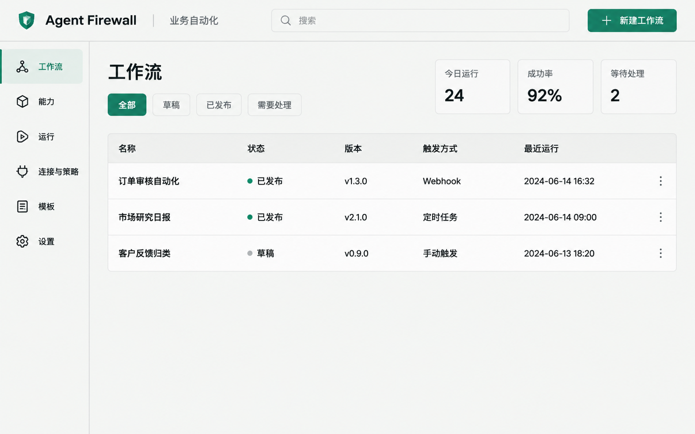

# Agent Firewall UI 设计说明

> **文档说明**：定义 Agent Firewall 智能体编排平台的产品信息架构、工作区布局、视觉语言、组件、状态和关键页面设计。
>
> **版本**：V1.1.0  
> **最后更新**：2026-07-13  
> **状态**：待评审

## 1. Design Direction

### 1.1 Audience

核心用户是反复搭建和运行自动化的流程创建者。他们需要快速扫描能力、连接数据、定位问题和接管失败节点，不需要营销式大标题或大面积装饰。

### 1.2 Concept

视觉方向：**精密自动化工作台**。

- 像控制台和工程制图桌，而不是云服务落地页。
- 信息密度高但层级稳定，画布始终是第一视觉中心。
- 不用紫色渐变、装饰光球、玻璃拟态或卡片嵌套。
- 颜色只承担能力类型、运行状态和风险含义。
- 节点以图标、左侧色条、文字和状态共同编码，不能只依赖颜色。

用户应记住的视觉特征：**浅色工程画布上的清晰能力节点，以及一眼可见的自动纠正轨迹。**

## 2. Information Architecture

| Navigation | Purpose | First release |
| :--- | :--- | :--- |
| Workflows | 默认首页，创建、运行和发布流程 | P0 |
| Capabilities | 导入中心、统一能力库、版本与健康 | P0 |
| Runs | 实时运行、历史、恢复、重放与比较 | P0/P1 |
| Connections & Policy | 模型、Git、Agent、MCP、凭据、审批 | P0 |
| Templates | 从模板创建流程 | P2 |
| Settings | 本地 runtime、外观和保留策略 | P0/P2 |

测试断言成为节点 Inspector 的“验收”页签；诊断和纠正进入运行抽屉；修订与比较进入工作流版本和 Runs。

## 3. Main Workflow Workspace

```text
┌──────────────────────────────────────────────────────────────────────────────┐
│ AF  工作流 / 订单审核自动化   Draft · 已保存        预检   运行   发布       │ 52
├──────┬───────────────┬───────────────────────────────┬───────────────────────┤
│      │ 能力 / 结构    │                               │ 节点设置               │
│ 全局 │ 搜索           │                               │ 输入 | 路由 | 验收 | 恢复│
│ 导航 │ Agent          │        编排画布               │                       │
│ 56px │ Skill          │        细点网格               │ schema 表单            │
│      │ Tool           │        节点与连线             │ 字段映射               │
│      │                │                               │ 纠正次数与失败去向      │
├──────┴───────────────┴───────────────────────────────┴───────────────────────┤
│ 预检问题 | 运行事件 | 最终结果                          可折叠底部抽屉         │
└──────────────────────────────────────────────────────────────────────────────┘
  56         248                   flexible                       336
```

### 3.1 Stable Dimensions

- Top bar：52px。
- Global icon rail：56px。
- Capability/structure rail：248px，可折叠到 44px。
- Inspector：336px，可折叠到 0。
- Bottom drawer：collapsed 40px，expanded 216-320px。
- Canvas node：216px 宽；内容变化不改变连接锚点位置。
- Minimum desktop viewport：1180 x 720。

底部抽屉占据布局行，不覆盖画布。运行时显示状态覆盖层，但不修改工作流草稿。

## 4. Visual Tokens

### 4.1 Light Workbench Theme

| Token | Value | Use |
| :--- | :--- | :--- |
| `--canvas` | `#F2F4F1` | 主画布和页面底色 |
| `--surface` | `#FFFFFF` | 工具栏、Inspector、列表 |
| `--surface-subtle` | `#E9EDE9` | 选中行、次级区域 |
| `--ink` | `#171B18` | 主文字 |
| `--muted` | `#677069` | 次级文字 |
| `--line` | `#D4DBD5` | 分隔线和输入边框 |
| `--accent` | `#177E67` | 主操作和当前选择 |
| `--agent` | `#2E6EA6` | Agent 节点 |
| `--skill` | `#3C8C59` | Skill 节点 |
| `--tool` | `#B87518` | MCP/Tool 节点 |
| `--correction` | `#C25442` | 纠正轨迹和失败恢复 |
| `--warning` | `#D49A20` | 等待与警告 |
| `--danger` | `#B64343` | 阻断与删除 |

### 4.2 Typography

- UI：`Source Sans 3`, `Noto Sans SC`, sans-serif。
- Code/data：`IBM Plex Mono`, `SFMono-Regular`, monospace。
- Page title：18px / 24px，600。
- Panel title：13px / 18px，600。
- Body：13px / 19px，400。
- Metadata：11px / 16px，400。
- 不随 viewport 缩放字体；所有 letter spacing 为 0。

### 4.3 Shape And Elevation

- Controls：4px radius。
- Nodes/dialogs：6px radius。
- 不使用胶囊形大按钮；状态 badge 可使用小圆角。
- 面板主要依赖 1px 分隔线，不依赖大面积阴影。
- 仅 dialog 和浮动菜单使用轻微阴影。

## 5. Key Components

### 5.1 Capability Row

- 32px 图标区，显示 Agent/Skill/Tool 类型。
- 名称一行，来源与版本一行。
- 右侧健康状态和拖拽把手。
- 不可用时保留在列表，显示具体原因，不静默隐藏。

### 5.2 Workflow Node

- Header：类型图标、节点名、运行状态。
- Body：能力版本、关键输入和结果摘要，最多 3 行。
- Footer：输入/输出端口和耗时。
- 左侧 3px 类型色条。
- Selected：2px accent outline，不改变节点尺寸。
- Running：顶部细进度条；Success/Failed 同时显示图标和文字。

### 5.3 Node Inspector

四个页签：

1. **Input**：常量、流程输入、前序输出映射。
2. **Routing**：成功/失败/字段条件与传递字段。
3. **Validation**：确定性规则、评审 Agent、通过条件。
4. **Recovery**：重试、纠正、备用能力、人工接管。

常用字段使用 schema 表单。JSON 放在 `<details>` 高级区域，不是默认编辑方式。

### 5.4 Bottom Drawer

- Preflight：按 blocker/warning 分组，点击定位节点和字段。
- Run Events：增量时间线，支持按节点和事件类型筛选。
- Result：结构化输出、验收摘要、下载、重放和发布入口。
- Waiting User：显示明确的“批准”“提供输入”“重试”操作，不出现通用“继续”。

### 5.5 Import Dialog

四步：

1. Source：Local/ZIP、Git、Remote Agent、MCP。
2. Scan：进度、连接结果、检测到的能力。
3. Review：契约、版本、权限、冲突策略。
4. Commit：导入结果和“加入当前流程”。

Dialog 宽度 880px；内部使用分栏与表格，不嵌套卡片墙。

## 6. Interaction States

| State | UI behavior |
| :--- | :--- |
| Empty workflow | 保留 Start/End，能力栏首项为“导入能力” |
| Autosaving | 标题旁显示“正在保存”，完成后变为“已保存” |
| Import scanning | 显示当前来源、文件数和可取消进度 |
| Import failed | 在来源或文件行内显示认证、网络、协议、格式或路径问题，保留重试和更换来源动作 |
| Import completed | 分别列出成功、跳过和失败项目，失败项不阻止已通过项目入库 |
| Capability unavailable | 能力行显示离线、缺凭据、发现过期或不兼容原因，并禁用“加入流程” |
| Connection failed | 保留已填写的非秘密配置，定位失败阶段，提供重新测试；秘密字段不回显 |
| Preflight blocked | 底部抽屉自动打开，Run 保持 disabled |
| Preflight warning | 警告可逐项确认，确认范围和操作者写入运行证据 |
| Running | 节点状态实时更新，编辑命令 disabled，查看仍可用 |
| Run canceled | 保留已完成节点和取消位置，提供查看证据和重新运行，不自动恢复 |
| Run failed | 显示失败节点、错误码、已用重试和可用 fallback，不只显示通用错误页 |
| Waiting input | Inspector 切换到 Recovery，显示缺少内容和上下文 |
| Approval required | 显示具体操作、能力、资源和本次批准范围 |
| Auto correcting | 显示 `第 2/3 次`、失败规则、修改摘要、再次验收 |
| Correction exhausted | 自动转失败路线或人工接管，不继续自旋 |
| Completed | 显示最终输出、验收摘要、重放和发布 |
| Trigger paused | 显示暂停原因、固定版本和积压策略，重复请求明确标为排队或跳过 |
| Worker offline | 触发器页和运行页共同显示后台不可用、最近心跳与重新启动动作 |
| Retention due | 在删除前提供导出证据和调整保留期，不能静默清理等待人工处理的运行 |

## 7. Motion And Feedback

- 页面首次加载：工具栏、能力栏、画布在 180ms 内依次出现。
- 节点状态：120ms 颜色与图标切换，不移动节点。
- Drawer：180ms ease-out 展开，占据布局空间。
- 连线激活：运行时 1.2s 低对比流动，仅当前路径显示。
- 支持 `prefers-reduced-motion`，关闭流动连线和 stagger。
- Toast 只用于完成反馈；错误必须留在相关字段、节点或抽屉中。

## 8. Accessibility

1. 所有颜色状态同时提供图标和文字。
2. 主文字对比度至少 4.5:1。
3. 所有按钮具有 visible focus 和 tooltip/accessible name。
4. 能力可通过键盘“添加到画布”，节点可通过方向键移动。
5. Inspector 页签使用正确 tab semantics。
6. 运行事件使用 `aria-live="polite"`，避免每次 token 变化都朗读。
7. 最长能力名和中文字段名必须换行或截断，不能覆盖端口和状态。

## 9. Complete Screen Matrix

生成稿以 1536 x 960 的桌面窗口为准。P01-P14 覆盖 0.1，P15-P18 覆盖 0.2，P19-P25 覆盖 0.3；实现时按版本边界交付，不要求首个 Beta 同时实现后续页面。

| ID | Release | Screen | Primary decision | Asset |
| :--- | :--- | :--- | :--- | :--- |
| P01 | 0.1 | Workflows 首页 | 创建、筛选或打开流程 | [01-workflows-home.png](assets/ui/01-workflows-home.png) |
| P02 | 0.1 | Builder / Input | 固定值、流程输入和上游输出映射 | [02-builder-input.png](assets/ui/02-builder-input.png) |
| P03 | 0.1 | Builder / Routing | 状态路线、字段条件、并行与汇合 | [03-builder-routing.png](assets/ui/03-builder-routing.png) |
| P04 | 0.1 | Import / Source | 选择 Local/ZIP、能力包、Git、Remote Agent 或 MCP | [04-import-source.png](assets/ui/04-import-source.png) |
| P05 | 0.1 | Import / Review | 检查契约、版本、权限、凭据和冲突 | [05-import-review.png](assets/ui/05-import-review.png) |
| P06 | 0.1 | Capability Library | 筛选能力并查看来源、健康和使用情况 | [06-capability-library.png](assets/ui/06-capability-library.png) |
| P07 | 0.1 | Contract Repair | 用示例运行或手工 schema 消除不确定输出 | [07-contract-repair.png](assets/ui/07-contract-repair.png) |
| P08 | 0.1 | Connections & Policy | 管理连接、权限和审批规则 | [08-connections-policy.png](assets/ui/08-connections-policy.png) |
| P09 | 0.1 | Credential Editor | 创建、测试和更新只写凭据 | [09-credential-editor.png](assets/ui/09-credential-editor.png) |
| P10 | 0.1 | Preflight Drawer | 定位 blocker/warning 并修复 | [10-preflight-drawer.png](assets/ui/10-preflight-drawer.png) |
| P11 | 0.1 | Run Start | 提交目标、初始输入和执行上限 | [11-run-start.png](assets/ui/11-run-start.png) |
| P12 | 0.1 | Live Run | 观察节点状态、事件与取消 | [12-live-run.png](assets/ui/12-live-run.png) |
| P13 | 0.1 | Human Recovery | 提供输入、审批或从失败节点恢复 | [13-human-recovery.png](assets/ui/13-human-recovery.png) |
| P14 | 0.1 | Run History & Detail | 查找历史并查看一次运行证据 | [14-runs-detail.png](assets/ui/14-runs-detail.png) |
| P15 | 0.2 | Validation Inspector | 配置确定性规则和评审 Agent | [15-validation-inspector.png](assets/ui/15-validation-inspector.png) |
| P16 | 0.2 | Recovery Inspector | 配置重试、备用能力、纠正与人工接管 | [16-recovery-inspector.png](assets/ui/16-recovery-inspector.png) |
| P17 | 0.2 | Auto-correction Live | 查看有限纠正和重新验收轨迹 | [17-auto-correction.png](assets/ui/17-auto-correction.png) |
| P18 | 0.2 | Replay & Compare | 重放固定依赖并比较两次运行 | [18-replay-compare.png](assets/ui/18-replay-compare.png) |
| P19 | 0.3 | Publish | 发布不可变版本并锁定能力版本 | [19-publish-version.png](assets/ui/19-publish-version.png) |
| P20 | 0.3 | Version History | 从旧版建草稿、比较和回滚触发器 | [20-version-history.png](assets/ui/20-version-history.png) |
| P21 | 0.3 | Schedule Trigger | 设置时区、下次运行和并发策略 | [21-schedule-trigger.png](assets/ui/21-schedule-trigger.png) |
| P22 | 0.3 | Webhook Trigger | 配置 URL、密钥、输入 schema 和启停 | [22-webhook-trigger.png](assets/ui/22-webhook-trigger.png) |
| P23 | 0.3 | Templates | 预览模板并创建草稿 | [23-templates.png](assets/ui/23-templates.png) |
| P24 | 0.3 | Workflow Package | 导入/导出依赖清单且排除凭据 | [24-workflow-package.png](assets/ui/24-workflow-package.png) |
| P25 | 0.3 | Runtime Settings | 管理 worker、存储、保留和诊断 | [25-runtime-settings.png](assets/ui/25-runtime-settings.png) |

## 10. State Boards

以下 8 张状态板覆盖 PRD 要求的 20 个异常、等待和完成状态。Hover、focus、toast 和 autosave 作为组件状态出现，不单独生成整屏。

| ID | Covered states | Asset |
| :--- | :--- | :--- |
| S01 | Workflows 空态、空画布、autosave | [state-01-workflow-empty-autosave.png](assets/ui/state-01-workflow-empty-autosave.png) |
| S02 | 导入扫描、Remote/MCP 认证/网络/协议失败、Local/ZIP 格式或越界拒绝 | [state-02-import-progress-errors.png](assets/ui/state-02-import-progress-errors.png) |
| S03 | Git 更新差异与冲突、导入成功与部分失败、能力离线/缺凭据/发现过期 | [state-03-import-update-results.png](assets/ui/state-03-import-update-results.png) |
| S04 | 连接测试失败、已保存凭据、删除被引用凭据 | [state-04-capability-connection-health.png](assets/ui/state-04-capability-connection-health.png) |
| S05 | Preflight blocked 与 warning | [state-05-preflight-blocked-warning.png](assets/ui/state-05-preflight-blocked-warning.png) |
| S06 | Run canceled、failed 与 waiting input | [state-06-run-terminal-recovery.png](assets/ui/state-06-run-terminal-recovery.png) |
| S07 | Approval required、correction exhausted 与 completed | [state-07-correction-complete.png](assets/ui/state-07-correction-complete.png) |
| S08 | Trigger paused/排队/跳过、worker 离线、Webhook 失败、保留期提示 | [state-08-trigger-worker-retention.png](assets/ui/state-08-trigger-worker-retention.png) |

## 11. Generated UI Gallery

按当前交付范围，P01 是唯一已生成的视觉参考；其余页面以本设计说明的页面矩阵、布局、组件与状态定义交付。生成提示词仍保留在 [UI assets README](assets/ui/README.md)，供后续需要位图稿时使用。



## 12. Design Handoff Checklist

- Workflows 已成为默认首页。
- 所有 Agent/Skill/Tool 节点都使用统一节点骨架。
- Inspector 覆盖 Input/Route/Validation/Recovery。
- 导入中心覆盖四类首批来源和权限预览。
- 预检、运行、人工接管和自动纠正都有完整状态。
- 运行抽屉不遮挡画布。
- 主流程不依赖 JSON 输入。
- 1180 x 720 与 1536 x 960 两个桌面尺寸无重叠和溢出。
- P01-P25 与 S01-S08 均有对应页面说明和 prompt manifest；位图生成不属于当前交付范围。

---

**文档版本**：V1.1.0  
**创建日期**：2026-07-13  
**最后更新**：2026-07-13  
**文档状态**：待评审
